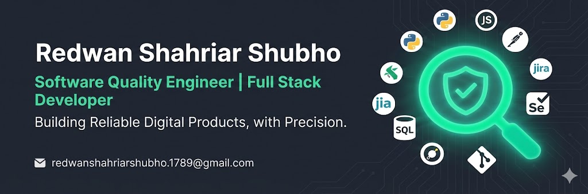

  
  
   

  

  
<strong>Computer Science & Engineering @ North South University</strong>

  
  

---

### 💡 Professional Profile

I am a **Software Engineer** specializing in **Quality Assurance (SQA)** and **Full-Stack Development**. I bridge the gap between high-performance application development and rigorous testing frameworks, ensuring software is resilient, scalable, and user-centric.

* 🔭 **Current Objective:** Actively seeking **SQA / Software Engineering** opportunities.
* 🛡️ **Quality Mindset:** Expert in identifying edge cases, optimizing the STLC, and maintaining a 360-degree view of product health.
* 🚀 **Track Record:** Successfully architected and deployed cross-platform mobile suites and full-stack e-commerce solutions.

---

### 💻 Skills & Technologies

<table align="center" width="100%">
  <tr>
    <td align="left" width="30%"><b>Quality Engineering</b></td>
    <td align="left">
      
      
      
      
    </td>
  </tr>
  <tr>
    <td align="left"><b>Web Development</b></td>
    <td align="left">
      
    </td>
  </tr>
  <tr>
    <td align="left"><b>Mobile & Tools</b></td>
    <td align="left">
      
    </td>
  </tr>
</table>

---

### 📊 Engineering Metrics

  
  

---

  
   
  
<strong><i>"Precision is the bridge between a requirement and a world-class solution."</i></strong>

